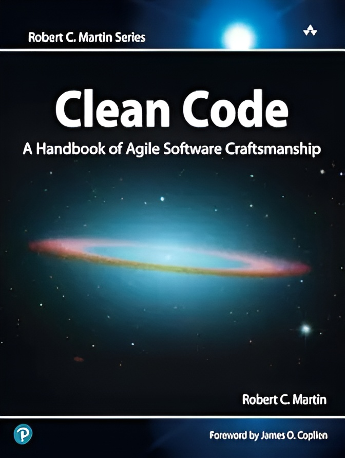

  

<h1 align="center">📘 ترجمه فارسی کتاب Clean Code</h1>

  یکی از بهترین و اثرگذارترین کتاب‌های برنامه‌نویسی برای یادگیری اصول نوشتن کد تمیز و قابل نگهداری

  
  
  
  
  

<h1>

   <a href="https://hheydarian.github.io/Gitab/" target="_blank"><strong>  گیتاب —  نسخه آنلاین کتاب </strong></a>

 </h1>

---

## ✨ معرفی پروژه

کتاب **Clean Code** نوشته *Robert C. Martin (Uncle Bob)* یکی از مهم‌ترین منابع در حوزه مهندسی نرم‌افزار و توسعه کد تمیز است.  
این کتاب به شما یاد می‌دهد چطور کدی بنویسید که خوانا، ساده، تست‌پذیر و قابل نگهداری باشد.  

این ریپازیتوری یک ترجمه آزاد و گروهی از این کتاب ارزشمند برای جامعه فارسی‌زبان برنامه‌نویسان است.  

---

## ⚙️ پیش‌نیاز مطالعه

🔹 برای تجربه خوانایی بهتر در مرورگر، توصیه می‌کنیم افزونه [فونت ایران](https://chromewebstore.google.com/detail/fontiran/edbchgkbejkdkdkpgenlaciegoidmjoh) رو نصب کنید.  

---

## 🙌 راه‌های مشارکت

ما به حضور شما در این پروژه افتخار می‌کنیم! مشارکت‌تون می‌تونه شامل موارد زیر باشه:

- 🔎 بازبینی و اصلاح ترجمه‌ها  
- 💡 ارائه پیشنهادات برای بهبود متن  
- 🎨 بهبود فرمت‌دهی و مثال‌ها   

---

## 🔗 فصل‌های کتاب (با لینک)

| شماره | نام فصل (انگلیسی)              | نام فصل (فارسی)                           | وضعیت | لینک |
|-------|---------------------------------|--------------------------------------------|--------|------|
| 00    | Introduction                    | مقدمه                                      | ✅     | [Introduction](Book/00_Introduction/Introduction.md) |
| 01    | Clean Code                      | کد تمیز                                    | ✅     | [Clean_Code](Book/01_Clean_Code/Clean_Code.md) |
| 02    | Meaningful Names                | اسامی با معنی                              | ✅     | [Meaningful_Names](Book/02_Meaningful_Names/Meaningful_Names.md) |
| 03    | Functions                       | توابع                                      | ✅     | [Functions](Book/03_3_Functions/3_Functions.md) |
| 04    | Comments                        | کامنت‌ها                                   | ✅     | [Comments](Book/04_4_Comments/4_Comments.md) |
| 05    | Formatting                      | فرمت‌دهی                                   | ✅     | [Formatting](Book/05_5_Formatting/5_Formatting.md) |
| 06    | Objects and Data Structures     | اشیا و ساختارهای داده                     | ✅     | [Objects_And_Data_Structures](Book/06_Objects_And_Data_Structures/Objects_And_Data_Structures.md) |
| 07    | Error Handling                  | مدیریت خطا                                 | ✅     | [Error_Handling](Book/07_Error_Handling/Error_Handling.md) |
| 08    | Boundaries                      | مرزها                                      | ✅     | [Boundaries](Book/08_Boundaries/Boundaries.md) |
| 09    | Unit Tests                      | تست‌های واحد                               | ✅     | [Unit_Tests](Book/09_Unit_Tests/Unit_Tests.md) |
| 10    | Classes                         | کلاس‌ها                                    | ✅     | [Classes](Book/10_Classes/Classes.md) |
| 11    | Systems                         | سیستم‌ها                                   | ✅     | [Systems](Book/11_Systems/Systems.md) |
| 12    | Emergence                       | پاک شدن از طریق طراحی پدیدارشونده          | ✅     | [Emergence](Book/12_Emergence/Emergence.md) |
| 13    | Concurrency                     | هم‌زمانی                                   | ✅     | [Concurrency](Book/13_Concurrency/Concurrency.md) |
| 14    | Successive Refinement           | بهبود تدریجی                               | ✅     | [Successive_Refinement](Book/14_Successive_Refinement/Successive_Refinement.md) |
| 15    | JUnit Internals                 | ساختار JUnit                               | ✅     | [JUnit_Internals](Book/15_JUnit_Internals/JUnit_Internals.md) |
| 16    | Refactoring SerialDate          | بازسازی SerialDate                         | ✅     | [Refactoring_SerialDate](Book/16_Refactoring_SerialDate/Refactoring_SerialDate.md) |
| 17    | Smells and Heuristics           | بوها و اصول                                | ✅     | [Smells_And_Heuristics](Book/17_Smells_And_Heuristics/Smells_And_Heuristics.md) |
| A    | Concurrency II           | هم‌روندی بخش دوم                                | ✅     | [Concurrency_II](Book/Appendix_A/Concurrency_II.md) |
| B    | org.jfree.date.SerialDate           | کلاس org.jfree.date.SerialDate                                | ✅     | [org.jfree.date.SerialDate](Book/Appendix_B/org.jfree.date.SerialDate.md) |
| C    | Cross_References_of_Heuristics           | ارجاعات متقابل هِوریستیک‌ها                               | ✅     | [Cross_References_of_Heuristics](Book/Appendix_C/Cross_References_of_Heuristics.md) |

---

## 🧩 اصول ساختاری پروژه

- فایل‌ها با فرمت `.md` نوشته شده‌اند  
- عکس‌ها داخل پوشه `assets/image/` ذخیره شده‌اند  
- برای یادگیری Markdown می‌تونید به [این منبع](https://markdown-fa-book.vercel.app/) مراجعه کنید  

---

## 🛡️ مجوز و حقوق نشر
<ul dir="rtl">
<li><b>حقوق نشر و کپی‌رایت کتاب اصلی: </b> متعلق به <i>Robert C. Martin</i> (Uncle Bob). </li>
<li><b>متن ترجمه: </b> تحت مجوز <code>CC BY-NC-SA 4.0</code> منتشر می‌شود. </li>
<li><b>نمونه کدهای داخل کتاب: </b> تحت مجوز <code>MIT License</code> منتشر شده‌اند. </li>
</ul>

---

## 🌟 قدردانی

سپاس ویژه از همه دوستانی که در این ترجمه و انتشار مشارکت کردن. 🌱  

---

ساخته شده با ❤️ توسط برنامه‌نویسان برای برنامه‌نویسان

