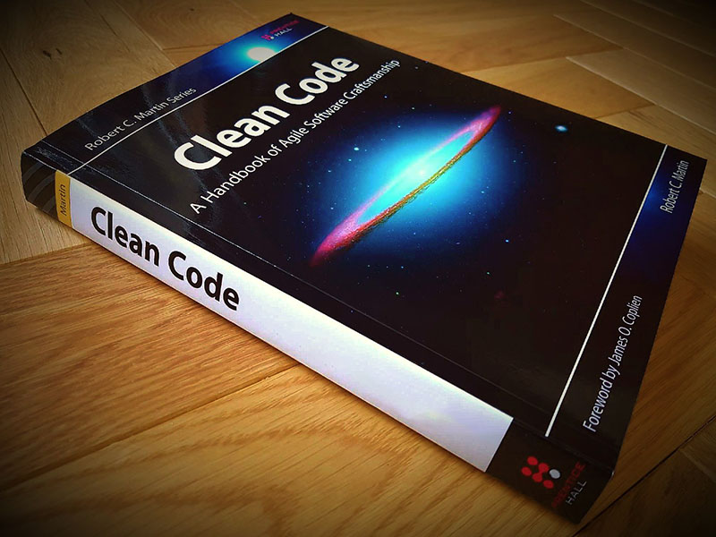

<h1 align="center"> ترجمه آزاد کتاب کد تمیز</h1>

  

این پروژه یک کار گروهی برای ترجمه آزاد یکی از بهترین کتاب های برنامه نویسی **Clean Code** هست.

## راهنمای مشارکت

فصول اصلی کتاب به طور کامل ترجمه شده و کتاب کامل است.

در ادامه کتاب بخش های `Appendix` آورده شده که ترجمه نشده اند .
اگر خواستید میتونید اون بخش هارو ترجمه کنید بعد یک pull request باز کنید منم توی اولین فرصت بررسی میکنم و به repo اضافه میکنم.

**قسمت های ترجمه نشده کتاب :**
- Appendix A - Concurrency II
- Appendix B - org.jfree.date.SerialDate
- Appendix C - Cross References of Heuristics
- Epilogue

اگر برنامه نویس `Java` هستید میتونید توی یکپارچه کردن کد های کتاب کمک کنید.
به علت استفاده از `formatter` های آنلاین هر قسمت از کد ها یک ساختار و نوع نوشتار دارند که زیادی چشم نواز و مرتب نیست. میتونید با یکپارچه کردن اونها به ما کمک کنید :)

اگر تصمیم گرفتید یک فصل رو کامل ترجمه کنید و یا تصمیم گرفتید کد ها رو یکپارچه و مرتب کنید لطفا قبلش یه ایمیل به <a href="mailto: wuka.sec@gmail.com">این آدرس</a>  بزنین تا توسط شخص دیگه یا خودم fix نشه و دوباره کاری پیش نیاد :)

## فرمت پروژه

در نام گذاری عکس ها فولدر ها و فایل ها دقت کنید و سعی کنید تا حد امکان با قسمت های دیگه پروژه یکپارچه باشند. (کافیه یه نگاه به نام گذاری ها بندازین تا متوجه منظورم بشید.)

## فصل های کتاب (ترجمه شده)

* [مقدمه](Book/00_Introduction/Introduction.md)
* [فصل 1 : کد تمیز](Book/01_Clean_Code/Clean_Code.md)
* [فصل 2 : اسامی با معنی](Book/02_Meaningful_Names/Meaningful_Names.md)
* [فصل 3 : توابع](Book/03_Functions/3_Functions.md)
* [فصل 4 : کامنت ها](Book/04_Comments/4_Comments.md)
* [فصل 5 : فرمت دهی](Book/05_Formatting/5_Formatting.md)
* [فصل 6 : اشیا و ساختار های داده](Book/06_Objects_And_Data_Structures/Objects_And_Data_Structures.md)
* [فصل 7 : مدیریت خطا](Book/07_Error_Handling/Error_Handling.md)
* [فصل 8 : مرز ها](Book/08_Boundaries/Boundaries.md)
* [فصل 9 : unit تست](Book/09_Unit_Tests/Unit_Tests.md)
* [فصل 10 : کلاس ها](Book/10_Classes/Classes.md)
* [فصل 11 : سیستم](Book/11_Systems/Systems.md)
* [فصل 12 : پاک شدن از طریق طراحی پدیدار‌شونده](Book/12_Emergence/Emergence.md)
* [فصل 13 : هم‌زمانی](Book/13_Concurrency/Concurrency.md)
* [فصل 14 : بهبود تدریجی](Book/14_Successive_Refinement/Successive_Refinement.md)
* [فصل 15 : ساختار JUnit](Book/15_JUnit_Internals/JUnit_Internals.md)
* [فصل 16 : بازسازی SerialDate](Book/16_Refactoring_SerialDate/Refactoring_SerialDate.md)
* [فصل 17 : بو ها و اصول](Book/17_Smells_And_Heuristics/Smells_And_Heuristics.md)
